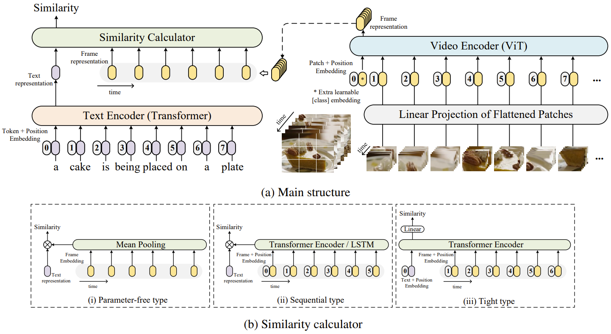

# CLIP4Clip: An Empirical Study of CLIP for End to End Video Clip Retrieval

The implementation of paper [**CLIP4Clip: An Empirical Study of CLIP for End to End Video Clip Retrieval**](https://arxiv.org/abs/2104.08860). 

CLIP4Clip is a video-text retrieval model based on [CLIP (ViT-B/32)](https://github.com/openai/CLIP). We investigate three similarity calculation approaches: parameter-free type, sequential type, and tight type, in this work. The model achieve SOTA results on MSR-VTT, MSVC, LSMDC, ActivityNet, and DiDeMo.



## Requirement
```
# From CLIP 
conda install --yes -c pytorch pytorch=1.7.1 torchvision cudatoolkit=11.0
pip install ftfy regex tqdm
pip install opencv-python boto3 requests pandas
```

## Data Preparing

**For MSRVTT**

The official data and video links can be found in [link](http://ms-multimedia-challenge.com/2017/dataset). 

For the convenience, you can also download the splits and captions by,
```
wget https://github.com/ArrowLuo/CLIP4Clip/releases/download/v0.0/msrvtt_data.zip
```

**For MSVD**

Raw videos can be download from [link](https://www.cs.utexas.edu/users/ml/clamp/videoDescription/). 

The splits and `raw_captions` can be found in the wonderful job [collaborative-experts](https://github.com/albanie/collaborative-experts/blob/master/misc/datasets/msvd/README.md). For the convenience, you can also download them by,
```
wget https://github.com/ArrowLuo/CLIP4Clip/releases/download/v0.0/msvd_data.zip
```

**For LSMDC**

You must obtain permission from MPII to download and use the data. The download link is [here](https://sites.google.com/site/describingmovies/download).
The 1000 test clips data is [link](http://www.google.com/url?q=http%3A%2F%2Fdatasets.d2.mpi-inf.mpg.de%2FmovieDescription%2Fprotected%2Flsmdc2016%2FLSMDC16_challenge_1000_publictect.csv&sa=D&sntz=1&usg=AFQjCNGIaGVhCeb6zNfUs2UL1zNzoEtaSg). Read our paper and the [dataloader](./dataloaders/dataloader_lsmdc_retrieval.py) for more information.

## Compress Video for Speed-up (optional)
```
python preprocess/compress_video.py --input_root [raw_video_path] --output_root [compressed_video_path]
```
This script will compress the video to *3fps* with width *224* (or height *224*). Modify the variables for your customization.

## How to Run 

>`--features_path` is the video root path
> 
>`--linear_patch` can be set with `2d` or `3d`
> 
> `--sim_header` can be set with `meanP`, `seqLSTM`, `seqTransf`, or `tightTransf`

read our paper for more details on `--linear_patch` and `--sim_header`. Test more hyperparameters for better performance. 

Download CLIP (ViT-B/32) weight,
```
 wget -P ./modules https://openaipublic.azureedge.net/clip/models/40d365715913c9da98579312b702a82c18be219cc2a73407c4526f58eba950af/ViT-B-32.pt
```
Then, run

### MSRVTT

```
DATA_PATH=[Your MSRVTT data and videos path]
python -m torch.distributed.launch --nproc_per_node=4 \
main_task_retrieval.py --do_train --num_thread_reader=0 \
--epochs=5 --batch_size=128 --n_display=50 \
--train_csv ${DATA_PATH}/MSRVTT_train.9k.csv \
--val_csv ${DATA_PATH}/MSRVTT_JSFUSION_test.csv \
--data_path ${DATA_PATH}/MSRVTT_data.json \
--features_path ${DATA_PATH}/MSRVTT_Videos \
--output_dir ckpts/ckpt_msrvtt_retrieval_looseType \
--lr 1e-4 --max_words 32 --max_frames 12 --batch_size_val 16 \
--datatype msrvtt --expand_msrvtt_sentences  \
--feature_framerate 1 --coef_lr 1e-3 \
--freeze_layer_num 0  --slice_framepos 2 \
--loose_type --linear_patch 2d --sim_header meanP
```

### MSVD
```
DATA_PATH=[Your MSVD data and videos path]
python -m torch.distributed.launch --nproc_per_node=4 \
main_task_retrieval.py --do_train --num_thread_reader=2 \
--epochs=5 --batch_size=128 --n_display=50 \
--data_path ${DATA_PATH} \
--features_path ${DATA_PATH}/MSVD_Videos \
--output_dir ckpts/ckpt_msvd_retrieval_looseType \
--lr 1e-4 --max_words 32 --max_frames 12 --batch_size_val 16 \
--datatype msvd \
--feature_framerate 1 --coef_lr 1e-3 \
--freeze_layer_num 0 --slice_framepos 2 \
--loose_type --linear_patch 2d --sim_header meanP
```

### LSMDC
```
DATA_PATH=[Your LSMDC data and videos path]
python -m torch.distributed.launch --nproc_per_node=4 \
main_task_retrieval.py --do_train --num_thread_reader=2 \
--epochs=5 --batch_size=128 --n_display=50 \
--data_path ${DATA_PATH} \
--features_path ${DATA_PATH}/LSMDC_Videos \
--output_dir ckpts/ckpt_lsmdc_retrieval_looseType \
--lr 1e-4 --max_words 32 --max_frames 12 --batch_size_val 16 \
--datatype lsmdc --feature_framerate 1 --coef_lr 1e-3 \
--freeze_layer_num 0  --slice_framepos 2 \
--loose_type --linear_patch 2d --sim_header meanP
```

# Citation
If you find CLIP4Clip useful in your work, you can cite the following paper:
```
@Article{Luo2021CLIP4Clip,
  author  = {Huaishao Luo and Lei Ji and Ming Zhong and Yang Chen and Wen Lei and Nan Duan and Tianrui Li},
  title   = {CLIP4Clip: An Empirical Study of CLIP for End to End Video Clip Retrieval},
  journal = {arXiv preprint arXiv:2104.08860},
  year    = {2021},
}
```

# Acknowledgments
Our code is based on [CLIP (ViT-B/32)](https://github.com/openai/CLIP) and [UniVL](https://github.com/microsoft/UniVL).
